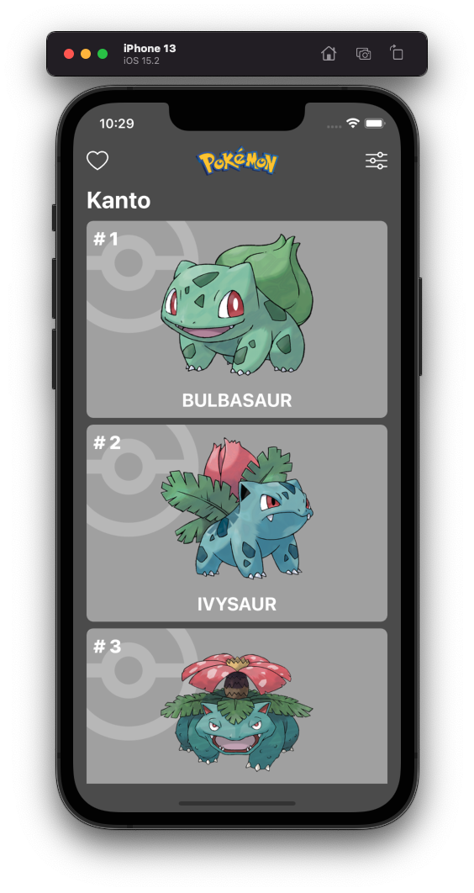
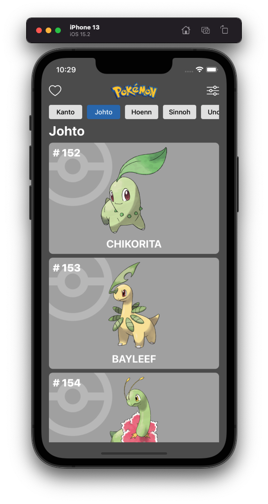
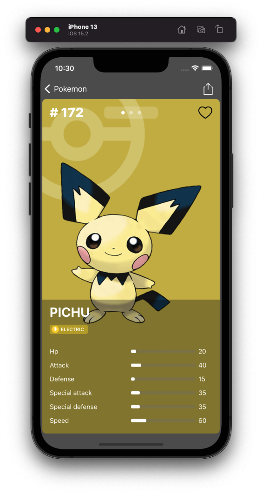
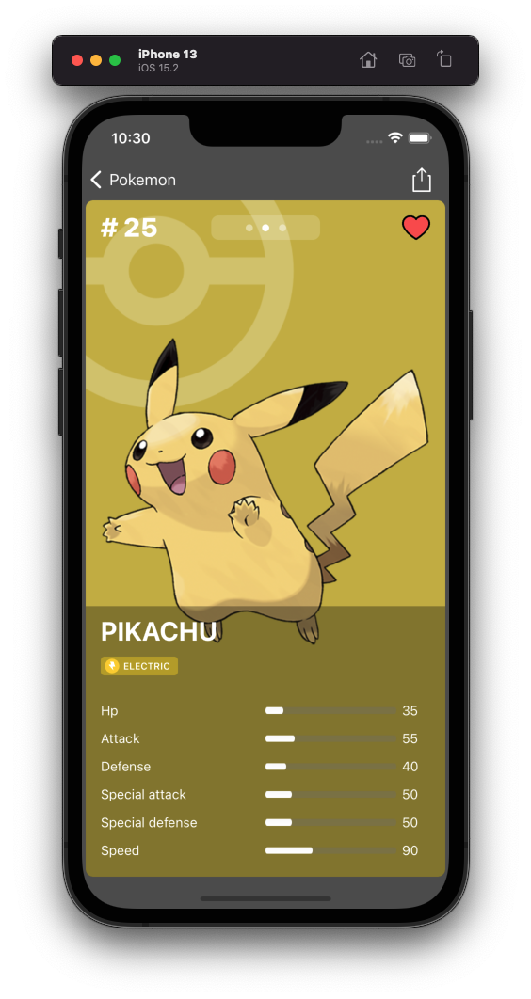
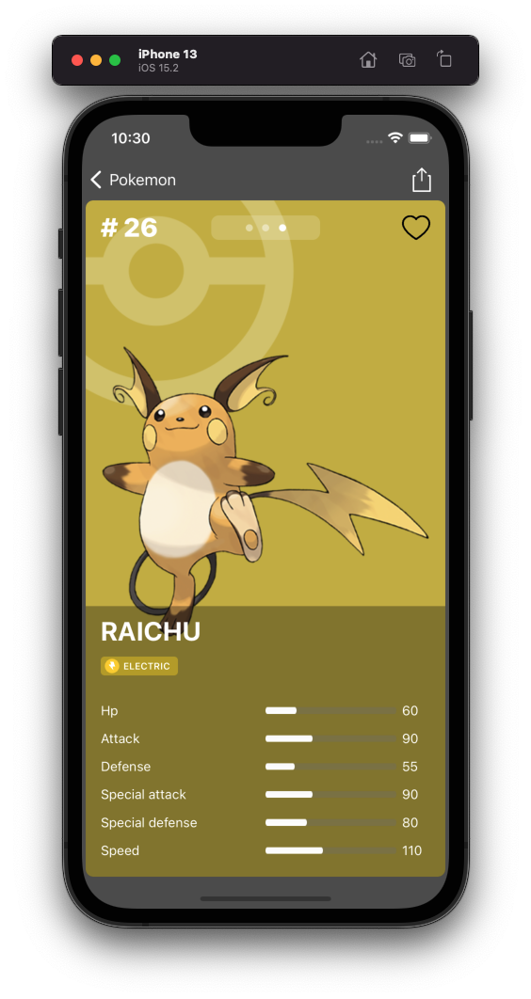

# Pokemon
Pokemon is an iOS application that interacts with the Pokemon API.

  
  
  
  
  
  

# Features
- List of Pokemon sorted by number and filtered by region from the Marvel API.
- Search Pokemon by region
- Detail of every Pokemon and its complete evolution chain
- Save your favorite Pokemon (add, remove or empty list)

# Architecture
- VIPER
- SOLID

# 3rd party libraries
- RxSwift
- Swinject
- Kingfisher
- SwiftLint

# Unit testing
- SwiftyMocky (+Sourcery)
- RxTest
- RxBlocking

# UI testing
- SnapshotTesting

# Requirements
- iOS 14.0+
- Swift 5.0+

# License
Copyright 2022 Jordi Gámez
